# Pride Sheep

Adds pride textures for nametagged sheep 🏳️‍🌈🏳️‍⚧️

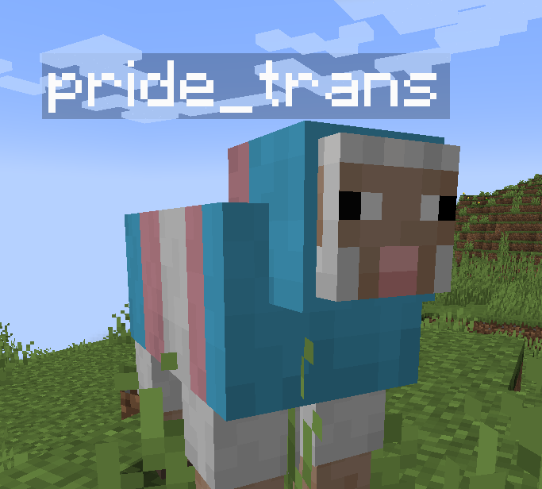

## Usage

Naming a sheep `pride_` suffixed with any of the following will change the
sheep's texture to the respective pride flag:

- `pride` for the classic pride flag
  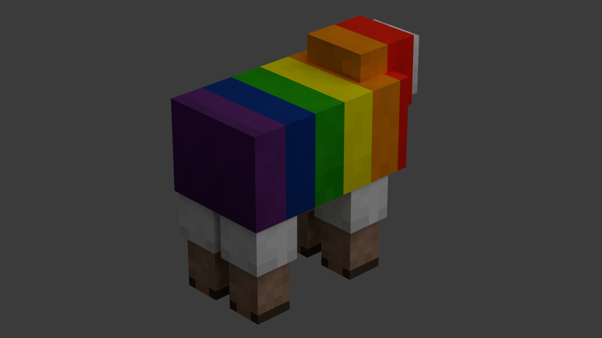
- `progress` for the progress pride flag
  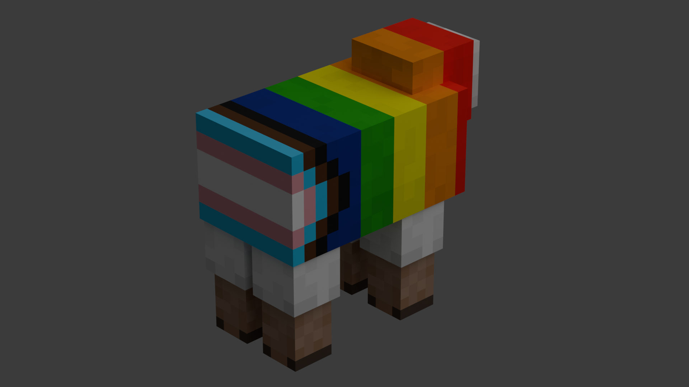

---

- `aroace`
  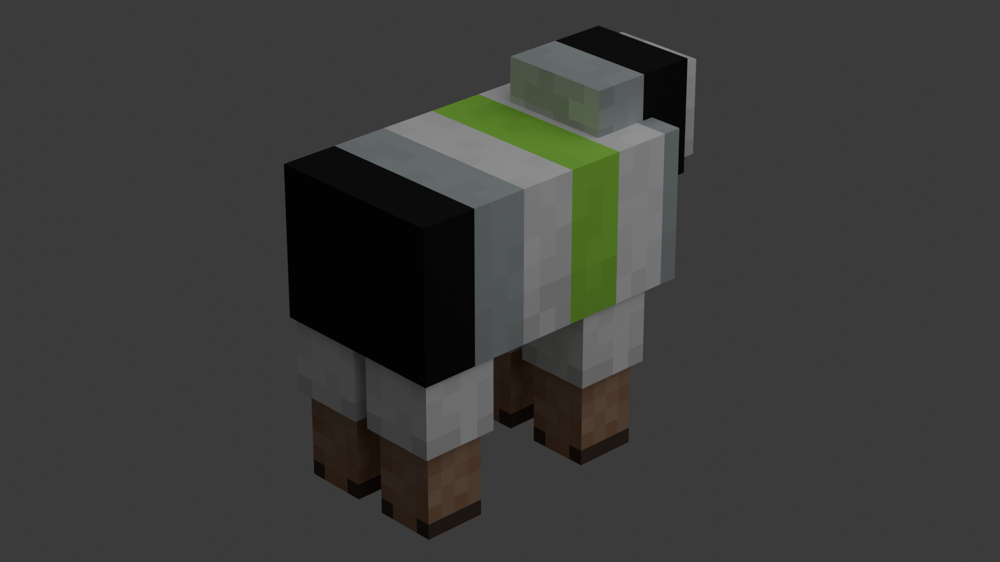
- `aromantic`
  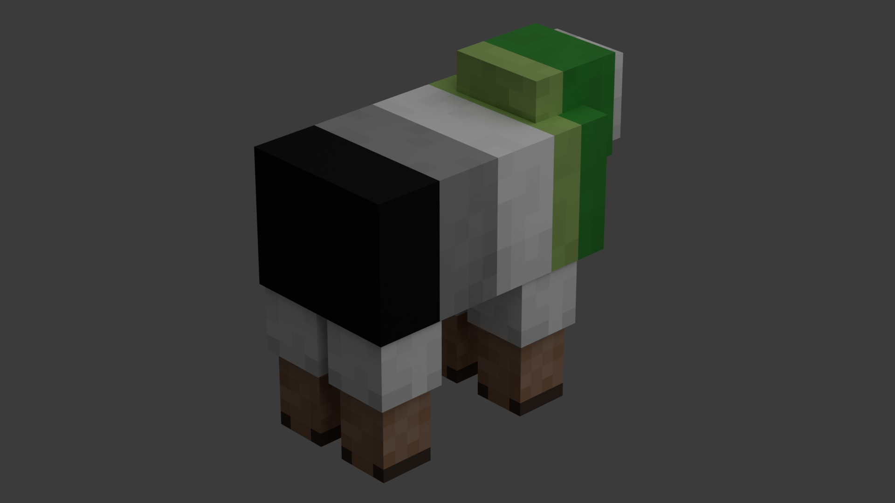
- `asexual`
  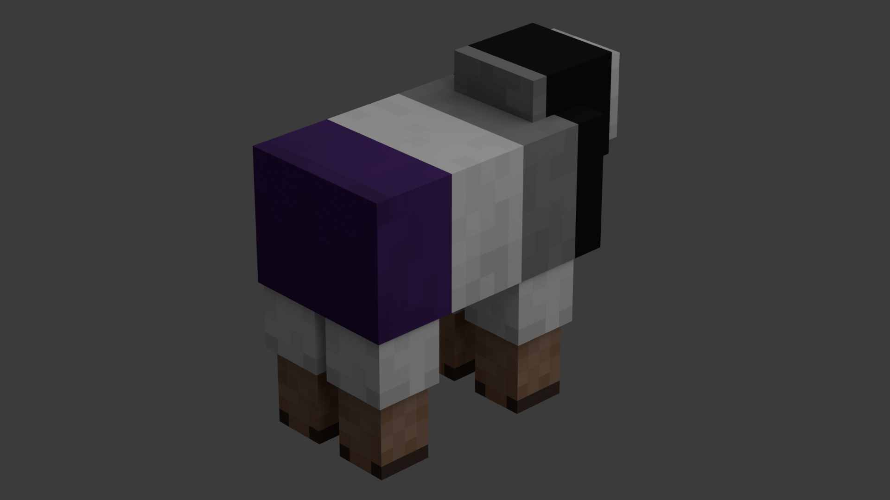
- `bisexual`
  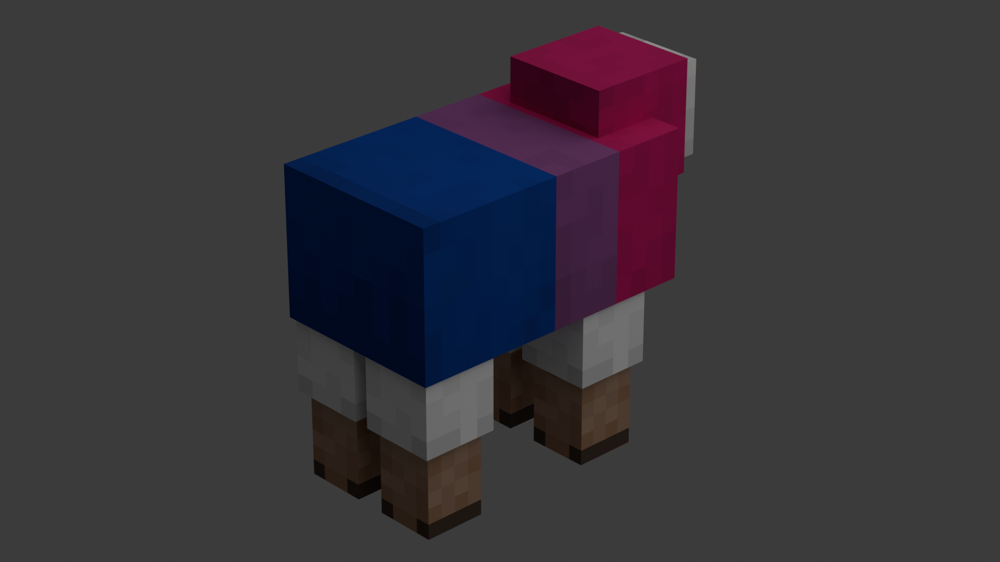
- `gay`
  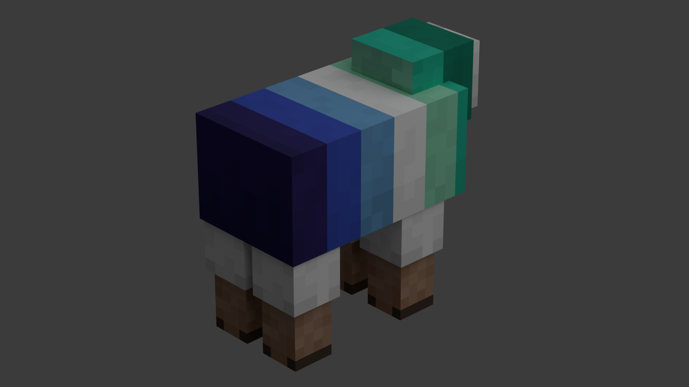
- `genderfluid`
  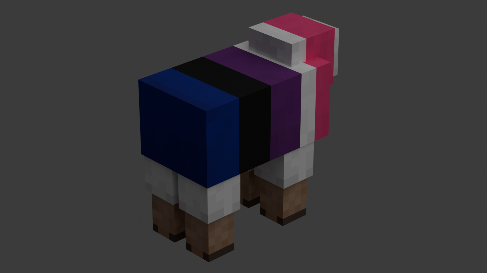
- `genderqueer`
  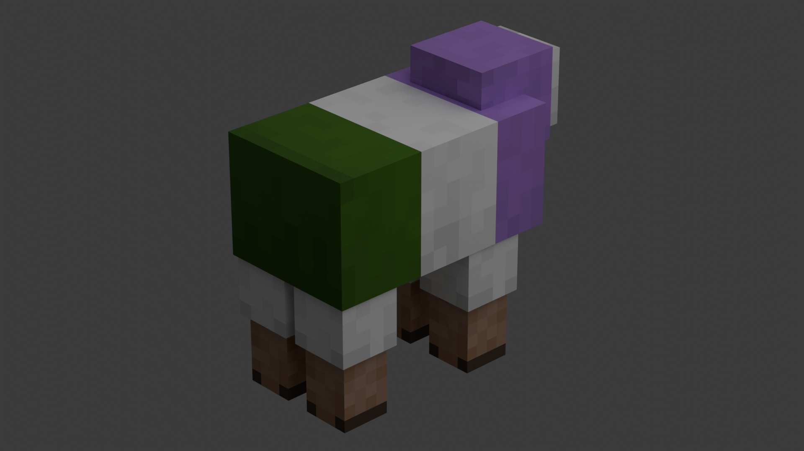
- `intersex`
  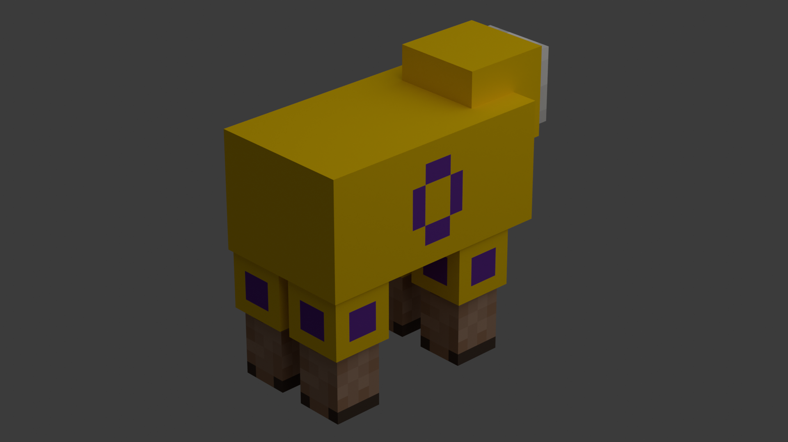
- `lesbian`
  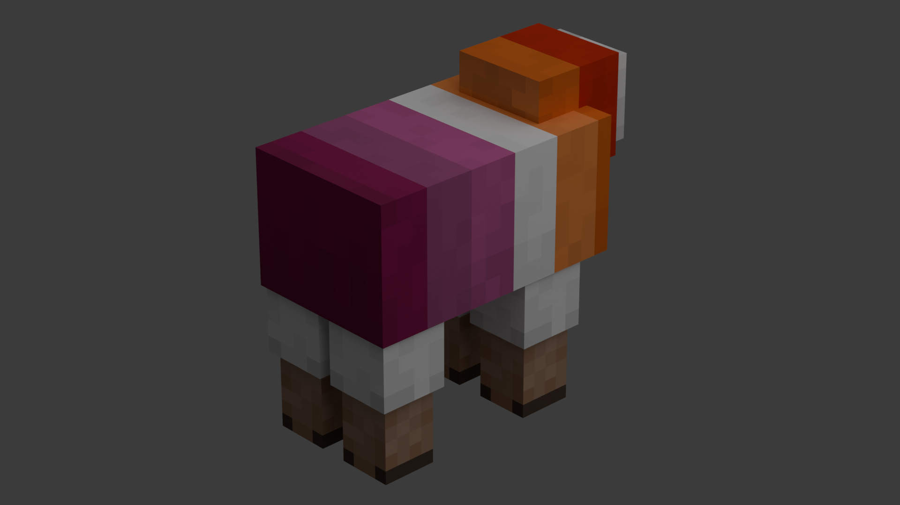
- `nonbinary`
  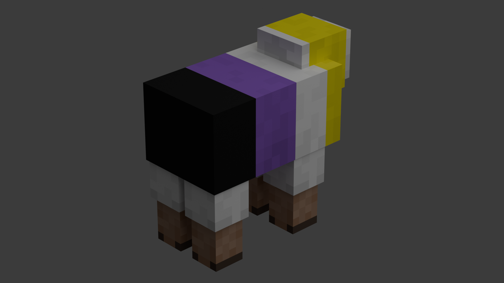
- `pansexual`
  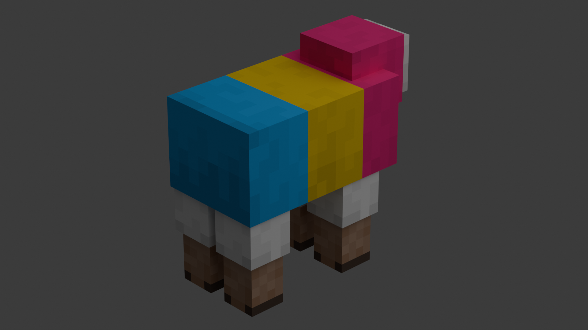
- `trans`
  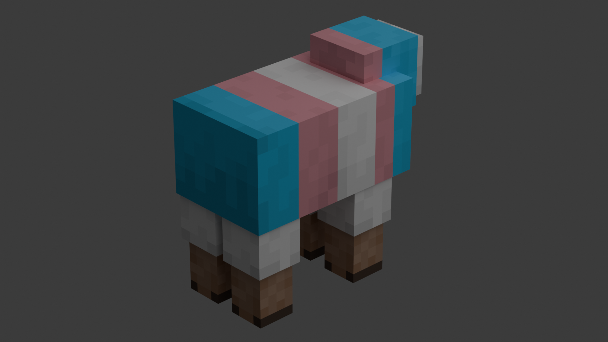

## Adding Your Own

To add your own pride flags, create a resource pack. Use the texture `minecraft:textures/entity/sheep/sheep_fur.png` as a template and put your textures in `pride-sheep:textures/entity/sheep/` (must be PNGs). Sheep named `pride_` and then the file name will show your custom texture.
